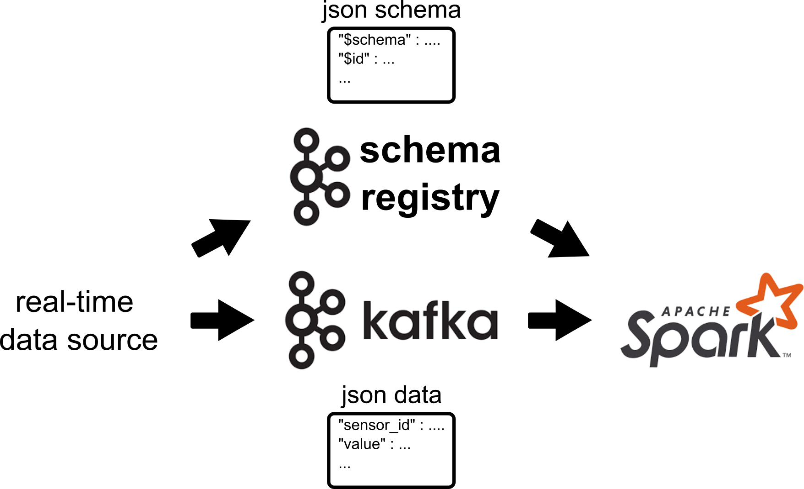

# Kafka to Spark Prototype



First, clone the repository
```
git clone https://github.com/andreariba/example-kafka-to-spark-stream.git
```
start the docker containers  
```
docker compose -f docker-compose.yaml up
```

To run the producer and consumer, open the jupyterlab at the port specified in the compose file (8888 by default) or connect to the container started from the image jupyter/all-spark-notebook.
```
docker exec -it <container_name_or_id> bash
```
create the files by copy and paste or clone the repository again inside the container. Launch them as normal python files.